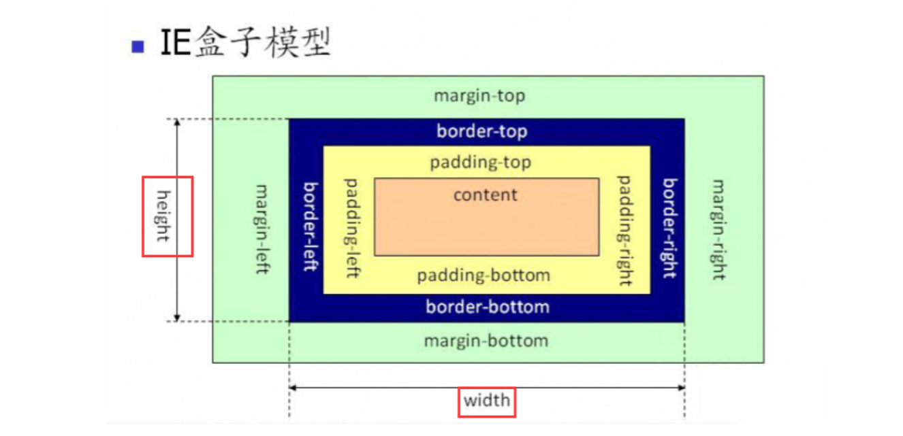
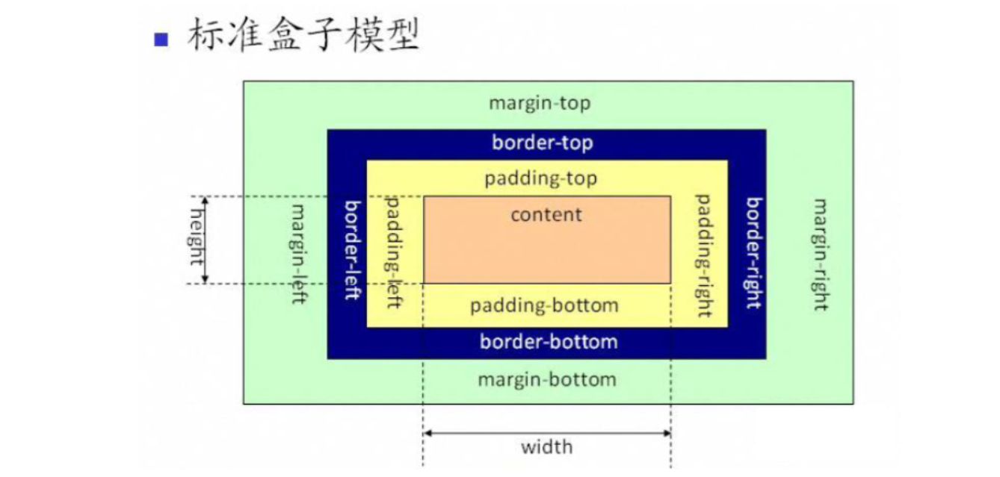
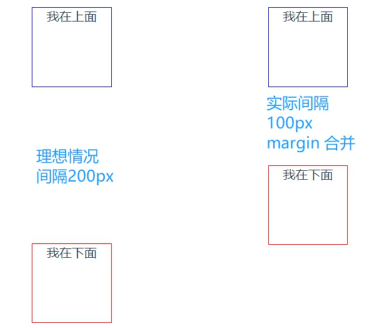
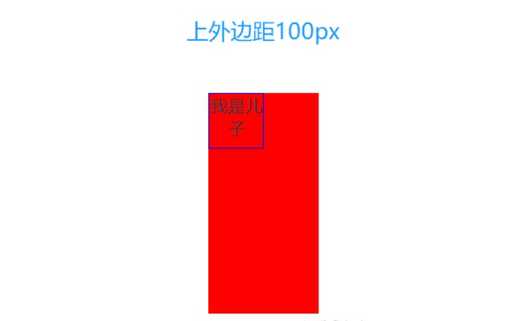

# 概念

CSS 盒模型本质上是一个盒子，盒子包裹着HTML 元素，盒子由四个属性组成，从内到外分别是：content 内容、padding 内填充、border 边框、外边距 margin

## 盒模型分类

* 怪异盒模型
  
  ```css
    box-sizing: content-box
    /* width = content-width + padding-width + border-width
   height = content-height + padding-height + border-height */
  ```



* 标准盒模型

  ```css
    box-sizing: border-box
    /*  width = content-width
    height = content-height  */
  ```
  


# margin合并

所谓外边距合并，指的是margin 合并，MDN是这样定义的：

块的顶部外边距和底部外边距有时被组合(折叠)为单个外边距，其大小是组合到其中的最大外边距，这种行为称为外边距合并。
要注意的是，外边距合并只针对块级元素，而且是顶部或底部的外边距

## 外边距合并有下面几种情况

* 相邻兄弟元素
  
```
   //HTML
<div class="up">我在上面</div>
<div class="down">我在下面</div>

//CSS
.up {
  width: 100px;
  height: 100px;
  border: 1px solid blue;
  margin: 100px;
}
.down {
  width: 100px;
  height: 100px;
  border: 1px solid red;
  margin: 100px;
}
```


* 父子元素
  
如果在块级父元素中，不存在上边框、上内补、inline content、清除浮动这四个属性，(对于不存在上边框和上内补，也可以理解为上边框和上内补宽度为0)，那么这个块级元素和其第一个子元素的存在外边距合并，也就是上边距”挨到一起“，那么此时父元素展现出来的外边距，将会是子元素的margin-top 和父元素的margin-top 的较大值。

```
//HTML
<div class="parent">
  <div class="child">我是儿子</div>
</div>
//CSS
.parent {
  width: 100px;
  height: 200px;
  background: red;
  margin-top: 50px;
}
.child {
  width: 50px;
  height: 50px;
  margin-top: 100px;
  border: 1px solid blue;
}
```


