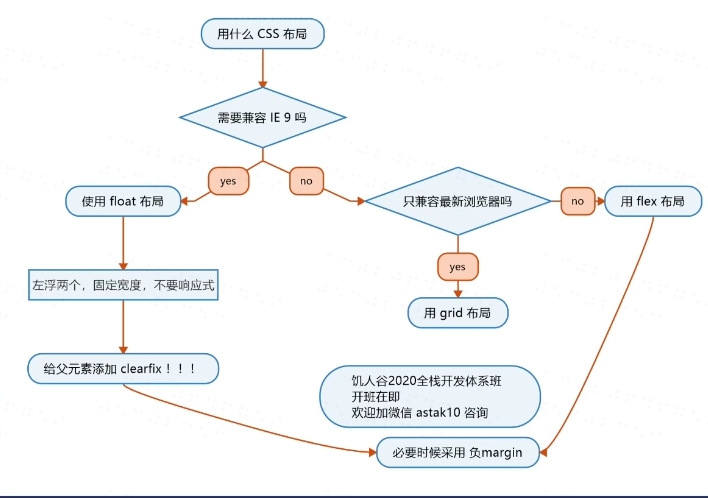
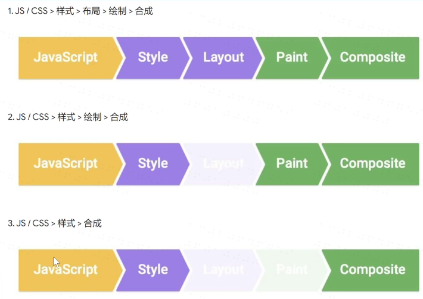
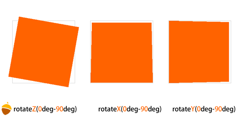

# css基础

## 文档流

* 首先要理解的几个重要的概念 :

1. 文档流
2. 块，内联，内敛块
3. margin合并
4. 两种盒模型(border-boxz更符合人类思维)
* 流动方向
1. inline元素从左向右，到达最右边才会换行
2. block元素从上到下，每一个都另起一行
3. inline-block 也是从左到右

* 宽度
1. inline宽度为内部inline元素的和，不能用width指定
2. block默认自动计算宽度。可用width指定
3. inline-block结合前者两者特点，可用width

* 高度

1. inline 高度由line-height 间接决定的，跟height无关
2. block高度由内部文档流元素决定，可以设height
3. inline-block跟block类似，可以设置height

* 溢出overflow
1. 当内容大于容器
2. 当内容的宽度或高度大于容器的，会溢出
3. 当可用overflow来设置是否显示流动条
4. auto 是灵活设置，scroll是永远显示。
5. hidden是直接隐藏溢出部分，visible是直接显示溢出部分

## 脱离文档流

* 哪些元素可以脱离文档流 ：
1. float
2. position:absolute(因为使用absolute脱离文档流后的元素，是相对于该元素的父类（及以上，如果直系父类元素不满足条件则继续向上查询元素进行定位的
并且这个父类元素的position必须是非static定位的（static是默认定位方式）
3.  fixed(完全脱离文档流，相对于浏览器窗口进行定位。（相对于浏览器窗口就是相对于html）

* margin 合并

  * 哪些情况会合并：
   1. 父子margin 合并
   2. 兄弟margin 合并
  * 阻止合并
      * 父子元素：
         1. padding / border
         2. overflow:hidden
         3. display:flex 
      * 兄第元素
         1. 可以用inline-block 消除

## css布局

* 分类
  1. 固定宽度布局(pc)
  2. 不固定宽度布局(手机)
  3. 响应式布局(混合布局)

* 布局的两种思路
 1. 从大到小
 2. 从小到大
 3. 布局用到哪些属性:
   
  


  ### float布局

  * 步骤：
 
 1. 子元素加上float：left 和width
 2. 在父元素上加.clearfix,即content:''; display：block; clear: both;
   * 经验：
   1. 有经验者会留一些空间，或者最后一个不设置width
   2. 专门为ie准备
   3. ie6/7 存在双倍bug,解决办法：1. 将错就错，把margin减半 2. 再加一个display：inline-block;
   4. outline也是加边框，但不占用实际宽度
   5. margin-left:auto ; margin-left: right; 要比margin：0 auto; 要好，没有改写上下文。margin,不该写的不要写。
  ### flex布局

  * 用法：display:flex;
  * 弹性流

     * 主轴对齐：
    1. flex-direction: row;一字排开
    2. flex-direction: column;竖向排列
    3. flex-direction: row-reverse;右→左
    4. flex-direction: column-reverse；左→右
    5. justify-content:flex-start; 内容占不满一行，默认从开始排列。
    6. justify-content:flex-end; 从末尾排列
    7. justify-content: center; 居中排列
     * flex-wrap: wrap;(折行)默认是不折行，一般要改为折行。
     * 次轴对齐：
    1. aline-items: center; 垂直对齐。
    2. aline-items: strech将内容设置为一样高。
     * 多行内容:
    1. align-content: flex-start; 将多余行高放下面。
    2. align-content: flex-end; 将多余行高放上面。
    3. align-content: flex-center; 将多余行高放中间
    4. align-content: strech
    5. align-content: space-between;将空间放在内容之间。
    6. align-content: space-around; 空间围绕内容。
    7. align-self: flex-start / flex-end; 让某一个item特立独行。
     * flex-grow: number; 用来给内容分配多余的空间。flex-shrink: number;控制如何变瘦，一般写0，防止变瘦。默认是1。
  ## 浏览器的渲染原理
    
 * 步骤： 
    1. 根据HTML构建HTML树（DOM)
    2. 根据CSS构建CSS树(CSSOM)
    3. 将两棵树合并成一颗渲染树(render tree)
    4. Layout 布局(文档流、盒模型、计算大小和位置)
    5. Paint绘制(把边框颜色、文字颜色、阴影等画出来）
    6. Compose合成(根据层叠关系展示画面)
   
    * 三种更新方式:
  
    1. 全走: div.remove()会触发当前消失，其他元素relayout
    2. 跳过layout：改变背景颜色，直接repaint + composite
    3. 跳过layout和paint: 改变transform，只需composite。
   
   

   ## css动画:

   ### Transform:

  
 * 我们在写网页的时候是不是大多数时候在操纵二维空间,但是在position绝对定位的时候，我们遇到了z轴，是不是可以理解为开辟了一个新的空间维度呢，但这也只是简单的层叠，css里有更强大的属性：Transform。

* 从字面上就能看出，Transform 是 "变型 的意思，他的值主要包括:

   * 旋转rotate

   * 扭曲skew

   * 缩放scale

   * 移动translate

   * 矩阵变形matrix

* 以rotate为例，3D Transform 中 rotate 有三种方法，rotateX(angle) X轴旋转，rotateY(angle) Y轴旋转，rotateZ(angle) Z轴旋转。

* XYZ表示一个平面以哪个轴为坐标来旋转，里面的值是他的角度。为了更形象一点，请看这张图。



### transition（过渡）
* 作用:
  
  补充中间帧

* 语法
1.  transition: 属性名 | 时长 | 过渡方式 | 延迟
2. 注意⚠️：指定第一个数字默认指定为时长，第二个数字默认才是延迟时间
```css
  transition: left 200ms linear

```
可以用逗号分隔两个不同属性
```css
  transition: left 200ms , top 400ms

  ```
可以用all代表所有的属性
```css
  transition:all 200ms

```
3. 过渡方式:

linear | ease | ease-in | ease-out | ease-in-out | cubic-bezier | step-start | step-end | steps

4. 常用的有：

* linear 线性
  
动画会以恒定的速度从初始状态过渡到结束状态

* ease 缓动
  
动画开始时逐步加速，中间逐渐减慢，结束时逐步加速

* ease-in-out
  
动画开始时缓慢，中间逐步加速，结束时逐渐减慢

* 延迟
  
延迟多久时间后执行动画

5. trabsition 变态部分:
  
  *  不是所有属性都能进行Transition（过渡）
  * display:none ==> block 显示和消失是无法过渡的～
  * 一般改成visibility:hidden ==> visibile
  * display与visibility 区别:
1. display:none（消失） | display:block（显示）
2. visibility:hidden （隐藏）| visibility:visibile（显示）
3. display:block 和 visibility:visibile 都有让元素显示的意思，那么两者的区别在与：

    * display:none（消失）是在不再占用空间

    * visibility:hidden （隐藏）使元素在网页上隐藏，但仍占用空间

### animation 动画
* 作用:
  
   * 声明关键帧
   * 添加动画

#### 声明关键帧
   * 语法
@keyframes 动画名{ }

   * 写法
```css
 /* <!-- from/to: --> */
@keyframes 动画名 {
      from {
        transform: translateX(0%);
      }

      to {
        transform: translateX(100%);
      }
    }
    /* 百分数 */
    @keyframes 动画名 {
  0% { top: 0; left: 0; }
  30% { top: 50px; }
  68%, 72% { left: 50px; }
  100% { top: 100px; left: 100%; }
}
```
   
#### 添加动画
* 语法

   * animation：动画名 | 时长 | 过渡方式 | 延迟 | 次数 | 方向 | 填充模式 | 是否暂停 |

   * 动画名 （animation-name）
  
    指定执行某个动画

    * 时长（animation-duration）
  
   s 或者 ms

   * 过渡方式（animation-timing-function）
  
   与transition取值是一样的

    * 延迟（animation-delay）
  
   延迟多久时间后执行动画

  * 次数（animation-iteration-count）
  
  数字（3或者2.4）或者 infinite（无限循环）

  * 方向（animation-direction）
  
     normal 默认正常
     reverse 相反方向
     alternate 默认正常方向循环（需要配合次数）
     alternate-reverse 默认相反方向循环（需要配合次数）
  * 填充模式（animation-fill-mode）
  
   none 默认
   forwards 最后静止不动（保持最后一帧）
   backwards （需配合延迟属性）立即应用第一个关键帧的样式，延迟结束   后，执行动画
   both (forwards+backwards相结合 需配合延迟属性）立即应用第一个关   键帧的样式，延迟结束后，执行动画，动画结束后保持最后一帧
  * 是否暂停（animation-play-state）
  
running 恢复运行动画
paused 暂停动画
使用以上两种方法制作动画
* 使用两次transform

.a===transform===>.b
配合setTimeout或者监听transitioned事件
.b===transform===>.c


   
  
     

     


   

  